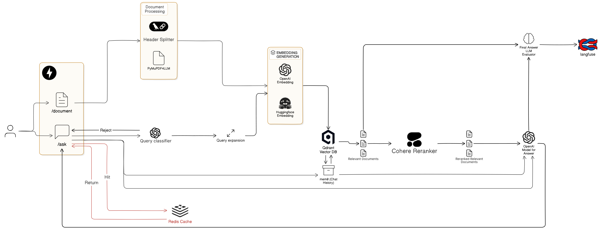

# Got Rejected from a Freelance RAG for Not Knowing How To Customize. I Built Every Block of The System to Learn It All

## What is it

Building Every block of RAG system for learning  


<b>Work in Progress</b>
## My Key Learning Points

### Architectural Insights

- **Python**: 
  - Modular Design, Isolated components
  - Easy extending/swapping to vector databases, LLM provider
  - Gradual adoption of new techniques

- **FastAPI Backend**:
  - Load model/service on startup (if using Local LLM)
  - Clean separation of endpoints with router

### RAG-Specific Learnings
- **Document Processing and Chunking Matter**:
  - PyMuPDF4LLM faster than docling. More to try: Markitdown, MinerU... 
  - Header Markdown preserves and gives more context to each chunk

- **Vector DB**:
    - Qdrant has more advanced search and filter
    - Chroma for simplicity and fast prototype project 
    - Should try Milvus (pretty much the same as Qdrant at small-scale project) 

- **Retrieval Optimization**:
  - Can find the embedding model at https://huggingface.co/spaces/mteb/leaderboard
  - Hybrid search (Dense + BM25). But sometimes metadata filtering then vector search works well
  - Reranking using Cohere API (can switch to local reranker like bge-reranker)

- **Memory**:
  - Some last messages should enough for short term memory. Sqlite should be fine
  - [mem0.ai](https://mem0.ai/) for more sophisticated memory management

- **Evaluation**:
  - Ragas metrics, use LLM as a Judge. Also can simply use cosine similarity. Final evaluator should be human 
  - Langfuse Tracing. New version of Mlflow can do it too


## Tech Stack

### Core Components
| Component | Technology | Purpose |
|-----------|------------|---------|
| **LLM** | OpenAI GPT-4o-mini | Text Generate |
| **Embeddings** | OpenAI text-embedding-3-large | Semantic representations |
| **Vector DB** | Qdrant | High-performance vector search |
| **API Framework** | FastAPI | REST API endpoints |
| **Document Processing** | PyMuPDF4LLM | PDF-to-Markdown conversion |

### Supporting 
| Component | Technology | Purpose |
|-----------|------------|---------|
| **Tracing** | Langfuse | LLM monitoring/tracing |
| **Evaluation** | Ragas | Retrieval quality metrics |
| **Chunking** | Custom LangChain Header Markdown Text Splitters | Document segmentation |
| **Environment** | Docker | Containerization |

## Project Structure

```bash
.
├── app/                       # API Layer
│   ├── api/                   # Versioned endpoints
│   │   └── v1/                # API v1
│   │       ├── chat.py        # Chat interactions
│   │       └── documents.py   # Document management
│   └── models/                # Pydantic schemas
│       ├── chat.py
│       └── documents.py       # PDF processing models
│       
├── core/                      # Business Logic
│   ├── embedding/             # Embedding strategies
│   │   ├── base.py            # Abstract class
│   │   └── openai.py          # OpenAI embeddings
│   ├── llm/                   # LLM interfaces
│   │   ├── base.py            # Abstract class
│   │   └── openai.py          # GPT-4 implementation
│   ├── processing/            # Document processors
│   │   ├── document_processor.py   # PDF→Markdown pipeline
│   │   └── document_splitter.py    # Smart text splitting
│   ├── retrieval/             # Retrieval modules
│   │   ├── base.py            # Abstract class
│   │   ├── qdrant.py          # Vector DB operations
│   │   └── reranker.py        # Cross-encoder
│   ├── tracing/               # Retrieval modules
│   │   └── tracer.py          # Langfuse tracer
│   └── evaluation/            # Quality metrics
│       └── ragas_eval.py      # Ragas integration
│
├── data/                      # ETL Pipelines
│   ├── loaders/               # Document loaders
│   └── transformers/          # Data converters
│
├── scripts/                   # Operational scripts
│   ├── ingest.py              # Bulk ingestion
│   └── evaluate.py            # Batch evaluation
│
├── tests/                     # Test suites
└── infra/                     # Deployment
    ├── docker-compose.yml     # Qdrant/Langfuse
    └── Dockerfile             # App container
```

## Techniques Implemented

### 1. Document Processing Pipeline
- **PDF-to-Markdown Conversion**: Preserves document structure using `pymupdf4llm`
- **Hierarchical Header Chunking**: Header-aware splitting (H1/H2/H3)
- **Metadata Enrichment**: Page numbers, source tracking, header context

### 2. Retrieval Optimization
| Technique | Implementation | Benefit |
|-----------|----------------|---------|
| Hybrid Search | Qdrant BM25 + Vector | Combines lexical/semantic search |
| Query Expansion | LLM-generated variants | Broader recall |
| Cross-Encoder Reranking | MiniLM-L-6-v2 | Precision optimization |
| Header Boosting | Score adjustment | Context-aware ranking |
